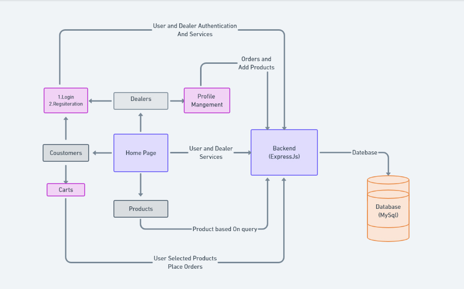

<!-- PROJECT LOGO -->
<br />
<p align="center">
  <a href="https://github.com/Sarthak480/LogSafe">
    
  </a>

  <h3 align="center">Oeys.Com</h3>

  <p align="center">
    A website for Demand and suply between different user and dealers from different places.
    <br />
    <a href="https://oeys.herokuapp.com/">View Website</a>
    ·
    <a href="#">Report Bug</a>
    ·
    <a href="#">Request Feature</a>
  </p>
</p>


<!-- ABOUT THE PROJECT -->
## About The Project  

[](https://oeys.herokuapp.com/)


### Built With

* [Node JS]()
* [MySQL]()
* [ExpressJS]()

<!-- GETTING STARTED -->
## Getting Started

To get a local copy up and running follow these simple steps.

### Installation

1. Clone the repo
   ```sh
   git clone https://github.com/AKKHILADI786/oeys
   ```
2. Install NPM packages
   ```sh
   npm install
   ```

## Usage

```npm run dev```


## File Structure

```
├───controlers          
├───database            //Database Models
├───images              //All images of products
├───public              //All frontend part
│   ├───app                  //js Files of All elements   
│   ├───css                  //css fiels of All frontend Part
│   ├───fonts                
│   ├───html                
│   ├───images               //images of home page
│   └───js                   // third party libraries
├───routes
│   ├───carts
│   ├───dealers
│   ├───orders
│   ├───product
│   └───users
├───uploads            // Required for dealer files uploading
└───utills             // for upload lots of product 
    └───jsons

```

<!-- CONTACT -->
## Contact


- [Akshay Kumar Verma](https://github.com/Akkhiladi786)


Project Link: [https://github.com/AKKHILADI786/oeys](https://github.com/AKKHILADI786/oeys)


